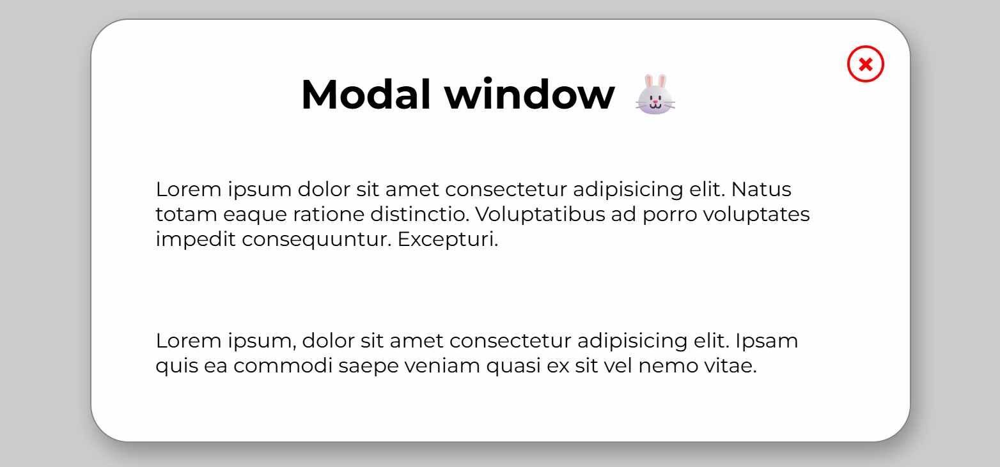

# 🪟 Modal Window

Простое модальное окно с различными способами закрытия

_Интерфейс_

## 🛠 Технологии

- **HTML** - структура модального окна
- **CSS** - стилизация и анимации
- **JavaScript** - логика открытия/закрытия

## ✨ Функциональности

- ✅ Открытие модального окна по клику
- ✅ Закрытие кнопкой (Отложенное появление, через 1 секунду)
- ✅ Закрытие кликом вне модального окна
- ✅ Закрытие клавишей ESC
- ✅ Плавное управление состоянием
- ✅ Простая интеграция в любой проект, без зависимостей

## 🚀 Запуск

Откройте `index.html` в браузере
